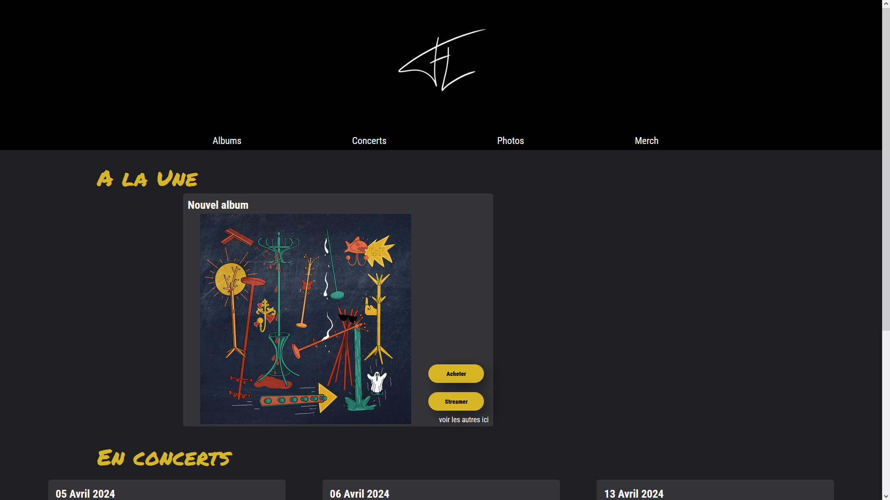
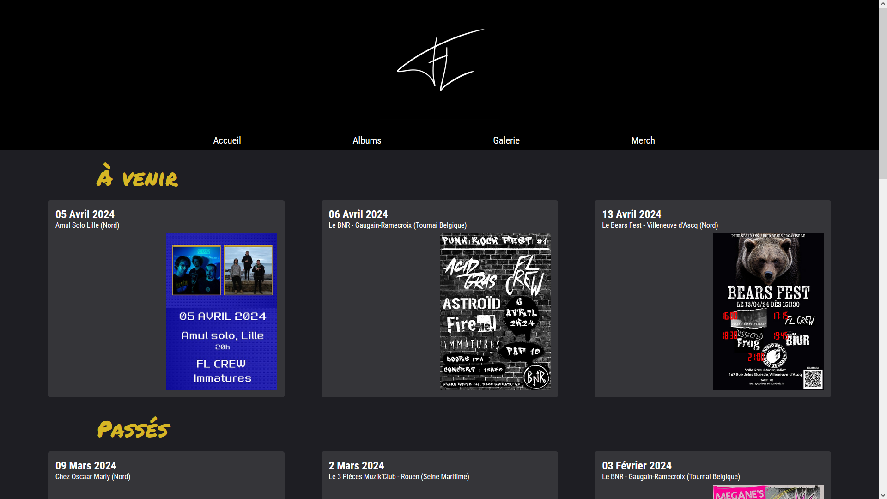
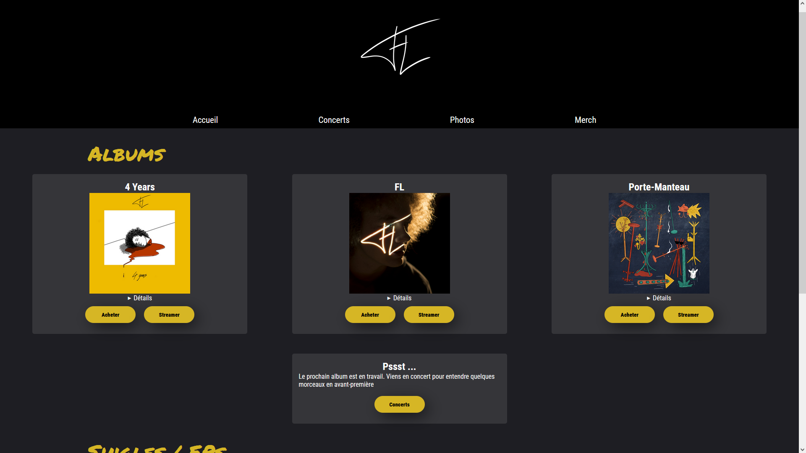

# FL Band Website
## Description

FL Band Website est un projet solo réalisé en 24 heures. Il s'agit d'un site vitrine pour un groupe de musique grunge garage local nommé FL. Le site vise à promouvoir le groupe, à partager des informations sur ses membres, son histoire, ses concerts à venir et à fournir un moyen de contact pour les fans et les organisateurs d'événements.

## Fonctionnalités

* Page d'accueil avec dernières actualités et concert à venir 
* Calendrier des concerts à venir
* Liste des albums 

## Technologies Utilisées

Le projet FL Band Website a été réalisé en utilisant les technologies suivantes :

* HTML
* CSS
* JavaScript Vanilla

## Comment exécuter le projet localement

* Clonez ce dépôt : git clone https://github.com/votre-utilisateur/nom-du-depot.git
* Ouvrez le fichier index.html dans votre navigateur web

## Capture d'écran

## Auteur

Ce projet a été réalisé par Imanol Deleporte

## Licence

Ce projet est sous licence MIT. Voir le fichier LICENSE pour plus de détails.